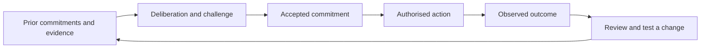

# com-jepa

**Organisational Commitment JEPA — learning from the commitments an organisation makes, keeps, changes, and fails to keep.**

An organisation makes promises that no individual can keep alone. Those promises bind people, resources, dependencies, and future action. Our starting proposition is that the organisation of 2026 and beyond should make this explicit: become a commitment machine and a learning machine, with technology organised around its people and purpose.

Today, people often carry the missing connections between business systems. They reconcile what was promised in one application, planned in another, recorded in a third, and understood in somebody's head. Humans have been middleware for too long. The organisation should own the continuity of its commitments; applications should help it act on them.

**com-jepa asks whether a history of commitments, decisions, actions, and observed consequences can improve the next organisational decision.** It starts with an explicit data contract and simple statistical models. It will investigate Joint Embedding Predictive Architectures (JEPA) if the evidence and data justify that step.

This is an open research project initiated by [Reflective Lab](https://www.reflective.se). It is at the research-design and data-contract stage, with an executable Random Forest demonstration trained on invented rows. There is no trained organisational JEPA model, production predictor, or empirical organisational performance claim in this repository. The included data is entirely fictional.

[Reflective research library](https://www.reflective.se/labs/research) · [Research plan](docs/research-plan.md) · [Data contract](docs/data-contract.md) · [Contribute](CONTRIBUTING.md) · [Security](SECURITY.md)

Initiated by **Kenneth Pernyér** · [ORCID 0009-0006-4543-1156](https://orcid.org/0009-0006-4543-1156).

## The organisation comes first

A commitment is more than a task or a prediction. It states what is owed, to whom, under whose authority, by when, with what evidence of fulfilment. Its reasoning, dependencies, and revisions need to survive meetings, application changes, and people leaving.

We call that continuity the **Organisation Core**: shared commitment identities, meaning, authority, history, and links to evidence. It can be distributed. Existing systems remain responsible for their domain facts. An invoice can live in accounting; the promise it fulfils can be understood across the organisation.

People and AI can build and operate this system together. AI can retrieve evidence, challenge assumptions, propose actions, and forecast consequences. People must retain the ability to understand, contest, and authorise consequential commitments. An organisation that becomes dependent on answers it cannot challenge has not achieved the kind of learning we seek.

The argument is developed in [The Physics of Organizations](https://www.reflective.se/series/physics), [Organizational Capability](https://www.reflective.se/series/organizational-capability), and [The System 3 Age](https://www.reflective.se/series/system-3). This repository turns those design convictions into questions, data structures, and experiments. They are premises to examine, not natural laws established by this project.

## The first prediction

> Given only what was known at time *t*, what is the probability that this accepted version of a commitment will meet its acceptance criteria by its stated deadline?

For example: a service team promises a customer a working integration by Friday. A dependency slips on Tuesday. The organisation records that evidence, considers alternatives, and authorises a response. On Friday it records what the customer actually received. If the deadline was revised to Monday, both promises and their outcomes remain visible.

The learning opportunity is the whole trajectory: what was expected, which evidence mattered, what action was authorised, what happened, and what should change next time. Later tasks may include time to fulfilment, revision risk, dependency failure, and the value of collecting more evidence. Predicting which intervention *causes* improvement requires a separate study.



Applications and models participate in this loop. Its durable history belongs to the organisation.

## Why JEPA is a research direction

Organisational records are irregular, incomplete, and full of detail that may not matter for an outcome. A useful representation might capture the relationships between promises, constraints, actions, and consequences without having to reconstruct every document or event.

JEPA offers a way to learn by predicting representations of missing or future context. A transformer is one possible encoder; JEPA is a training approach, not a successor that automatically replaces transformers. [T-JEPA](https://arxiv.org/abs/2410.05016) provides a relevant structured-data precedent. [V-JEPA 2](https://arxiv.org/abs/2506.09985) provides inspiration for learning predictive representations and action-conditioned dynamics. Neither establishes that this works for organisations.

The research must earn each step:

1. Capture trustworthy commitment trajectories and outcomes.
2. Establish base rates, explicit rules, and conventional machine-learning baselines.
3. Test whether sequence and dependency information add predictive value.
4. Compare JEPA against equally informed alternatives.
5. Test transfer between organisations and controlled local adaptation.
6. Test whether using predictions improves commitments and human judgment.

A simple model that wins is a successful research result. A shared model valid for most organisations is a hypothesis, not a promise.

## Start here

| Document | What it establishes |
| --- | --- |
| [Foundations](docs/foundations.md) | The organisation, human agency, and learning from priors |
| [Research plan](docs/research-plan.md) | Hypotheses, comparisons, evaluation, and stop conditions |
| [Data contract](docs/data-contract.md) | What to collect, label, connect, and keep out |
| [Random Forest demo](docs/random-forest-demo.md) | A small CPU-only classifier, historical base-rate comparison, and temporal checks on synthetic data |
| [TabPFN-3 comparison](docs/tabpfn-comparison.md) | An optional GPU experiment using the same rows and a pinned pretrained classifier |
| [Application integration](docs/application-integration.md) | How apps contribute to the Organisation Core |
| [First 90 days](docs/first-90-days.md) | A bounded starting project and collaboration questions |
| [Reading list](docs/reading-list.md) | Intellectual lineage and the limits of the evidence |

## Run the first artefact

Python 3.11 or later:

```sh
python3 -m venv .venv
.venv/bin/python -m pip install -r requirements.txt
.venv/bin/python -m unittest discover -s tests -v
.venv/bin/python -m com_jepa validate examples/fictional-trajectory.jsonl
.venv/bin/python -m com_jepa snapshot examples/fictional-trajectory.jsonl --as-of 2026-01-06T12:00:00Z
```

This validates the draft event contract and constructs the context available at a historical prediction cutoff. It demonstrates exclusion of late-arriving evidence, future actions, and outcome assessments from predictor inputs. It does **not** train a model or establish that a dataset is suitable for research. See [the example walkthrough](examples/README.md).

The validation command reports **11 valid fictional events**. The Tuesday-noon snapshot contains **e01, e02, and e03**: the accepted promise, a reported delay, and a proposed response. An observation made earlier but received Wednesday is correctly excluded. The test suite checks these boundaries and the preservation of both commitment versions.

## Project status

To try the optional ML example, use Python 3.14 and the pinned scikit-learn dependencies:

```sh
python3.14 -m venv .venv
.venv/bin/python -m pip install -r requirements-ml.txt
.venv/bin/python -m com_jepa.forest_demo
```

This fits a Random Forest to 300 invented commitment snapshots and compares it with the training fulfilment rate on a later test period. Unknown/disputed/censored labels are excluded, and training labels must be available before fitting. See the [demo guide](docs/random-forest-demo.md) for the exact synthetic rule, JSON reports, and limitations. PyTorch and a GPU are not required.

| Available now | Proposed next |
| --- | --- |
| Organisational thesis and falsifiable research questions | Practitioner review and selection of one commitment family |
| Draft JSON Schema, fictional trajectory, and historical context utility | A governed prospective pilot and real outcome adjudication |
| Temporal and lineage tests; GitHub CI | A reproducible benchmark with conventional ML baselines |
| Synthetic Random Forest example and base-rate comparator | Real-data feature extraction, outcome adjudication, and validation |
| Evaluation and application-integration proposals | Sequence/graph experiments and, if justified, JEPA |

No partner participation, dataset access, generalisation result, or model efficiency is implied by this roadmap. See the [claims ledger](docs/reading-list.md#claim-boundaries).

## Contribute

We need organisational practitioners who can define meaningful outcomes; process-mining and applied-ML researchers who can challenge the evaluation; representation-learning researchers who can test JEPA; and human–AI interaction researchers who can assess agency and learning. CIOs and operational leaders can help establish whether the problem and data collection are worth the effort.

Start with [CONTRIBUTING.md](CONTRIBUTING.md). Disconfirming evidence, simpler baselines, and criticism of the commitment abstraction are welcome. Please contribute fictional examples and methods, not private organisational or employee data.

Kenneth Pernyér initiates and maintains the project; research, engineering, operational experience, and critical review are all recognised contributions. See [contributors](CONTRIBUTORS.md), [governance](GOVERNANCE.md), and the [code of conduct](CODE_OF_CONDUCT.md).

## Cite and reuse

Use [CITATION.cff](CITATION.cff) and cite the exact commit used in an experiment. This repository is a research project, not a peer-reviewed finding. Cite the original papers separately when relying on their results.

Original repository content is [MIT licensed](LICENCE). Linked publications and any future third-party datasets retain their own licences. The licence does not grant rights to private organisational data or imply endorsement by Reflective Lab.
