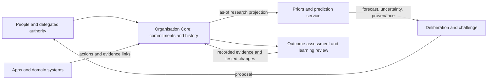

# A brief for application developers

Build around the organisation's commitments. An application is a way to participate in organisational work; its local task state is not the complete organisational truth.

## A concrete flow

An application helps a team propose a customer commitment. An authorised person or delegated process accepts a version. Delivery and finance tools contribute observations under that commitment's stable identity. A forecasting service reads an as-of projection and returns a versioned prediction. A deliberation surface presents evidence, uncertainty, and alternatives. An authorised response creates new action or revision events. Later observations support an assessment of the original and revised promises.

The arrows describe proposed responsibilities, not implemented integrations in this repository.

## Responsibilities

| Surface | Responsibility |
| --- | --- |
| Organisation Core | Stable identity, accepted meaning, version lineage, authority, evidence links, and durable history |
| Domain systems | Authoritative domain facts and provenance; observable contributions to commitments |
| Applications | Task-appropriate participation, interpretation, challenge, and authorised actions |
| Research/training pipeline | Governed exports, time-aware datasets, evaluation, and derived model artefacts |
| Prediction service | Reproducible forecasts, uncertainty, applicable scope, and abstention |
| Human/delegated governance | Deciding what may be committed, revised, or executed |

For Reflective, Quorum Sense is a possible first application surface. Converge suggestors and Organism formations are prospective consumers of learned priors; Crucible is a possible home for training/inference adapters. The public [research directory](https://www.reflective.se/labs/research) describes this background. com-jepa defines research questions and portable contracts; it does not assert these integrations are implemented or depend on a private runtime.

## The first vertical slice

1. Create and accept a commitment with explicit criteria, beneficiary, authority, and deadline.
2. Preserve its stable ID across two application surfaces or one app and a domain-system adapter.
3. Append a dependency observation and an authorised action with occurrence and availability timestamps.
4. Reconstruct what was known at a selected cutoff using the research export.
5. Revise the commitment explicitly, retaining its original version and reason.
6. Assess each version against its own criteria and deadline using external evidence.
7. Record one proposed practice change and later evidence about whether it helped.

This slice is useful before training any model. Its acceptance test is whether another person can reconstruct the promise and its consequences without relying on the original meeting participants.

## What a future prediction response must carry

The commitment ID/version, target definition, context cutoff, context manifest, model and feature versions, probability or interval with a stated interpretation, calibration reference, applicability limits, and abstention reason when needed. Evidence links should make review possible. Feature attribution or similar past cases must not be presented as a proven causal explanation.

The current `forecast.recorded` event captures only part of this proposed response. Add a versioned response schema and advice-exposure events before deployment. Freeze the selected model within a decision episode, and retain the exact prediction that participants saw.

## Design acceptance criteria

- A quiet deadline edit cannot erase an earlier commitment or turn its failure into success.
- A proposal, an authorised action, a completed action, and a fulfilled commitment remain distinct.
- An app can display disagreement and insufficient evidence without forcing a success/failure answer.
- Personal learning remains separate from shared commitment outcomes. Participants can interrogate assumptions and explain their decision.
- A forecast can inform an option or prompt more evidence. It cannot grant itself authority or silently change governing rules.
- All model candidates can be replaced by a simpler baseline without changing the organisation's canonical record.

Do not begin by adding an embedding column to every business object. Begin by making one meaningful commitment traceable across applications and time.
